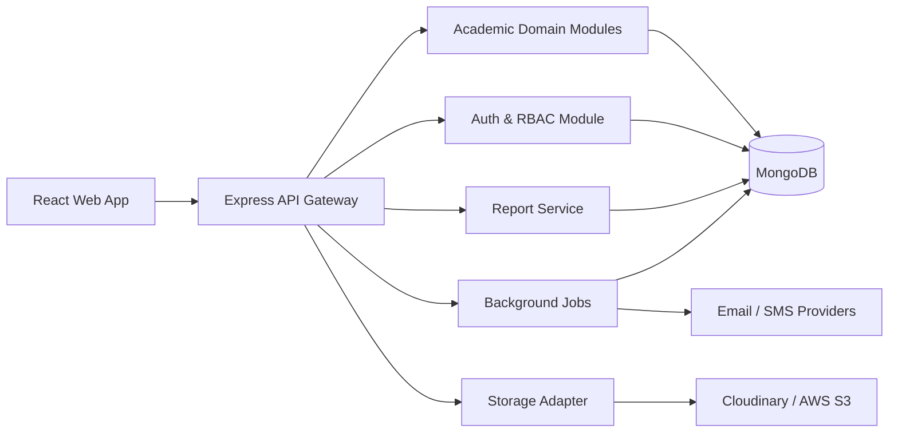
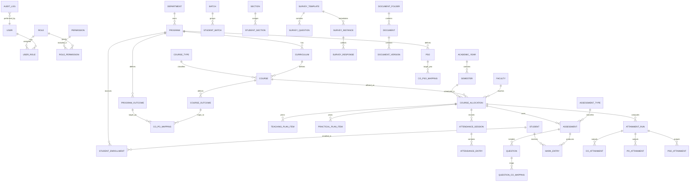

# EduOBE Implementation Blueprint

## 1. Complete Requirement Analysis

### 1.1 Product Goal
Build a production-ready MERN platform for engineering colleges to manage outcome-based education, academic quality assurance, accreditation workflows, audits, reporting, and academic operations from a single configurable system.

### 1.2 Core Principles
- UI-driven configurability for course types, assessment types, mappings, formulas, and workflows
- No hardcoded academic structures
- Multi-role access with configurable permissions
- Full auditability and version history
- Reusable domain model for current and future curriculum designs
- Production readiness: security, scale, observability, deployment, and CI/CD

### 1.3 Functional Modules
1. Identity and access management
2. Academic master data management
3. Student management
4. Faculty management
5. Course and course allocation management
6. CO / PO / PSO management and approvals
7. CO-PO-PSO mapping matrix
8. Working days and academic calendar
9. Attendance management
10. Teaching and practical planning
11. Dynamic assessment engine
12. Question bank and question paper generation
13. Marks and grading management
14. Attainment engine
15. Slow learner management
16. Advanced learner management
17. Beyond syllabus activity management
18. Survey builder and analytics
19. Document management with versioning
20. Dashboards and analytics
21. PDF / Excel reporting
22. Notifications
23. Audit trail and compliance

### 1.4 Non-Functional Requirements
- Secure JWT auth with refresh token rotation and optional 2FA
- RBAC plus permission-level controls
- Horizontal scalability for API and frontend
- Async processing for imports, exports, and heavy reports
- Traceable audit logs for all create/update/delete/approve actions
- File versioning and controlled evidence storage
- Strong validation and consistent API contracts
- Index-driven query performance for academic and reporting filters
- Backup and disaster recovery support
- Containerized deployment with CI/CD

### 1.5 Primary User Journeys
- **Super Admin**: configure institution, roles, permissions, masters, workflows, system settings
- **Principal / HOD / IQAC / NBA**: review analytics, compliance, attainment, reports, approval queues
- **Program Coordinator**: manage PO/PSO, mappings, curriculum-level analytics
- **Faculty / Lab Instructor**: manage course execution, attendance, plans, assessments, marks, attainment inputs
- **Student**: view attendance, marks, surveys, notifications, academic status
- **External Auditor**: review controlled evidence, reports, audit findings

### 1.6 Approval Workflows
- CO creation and version approval
- CO-PO-PSO mapping approval
- Question paper approval
- Report lock/finalization approval
- Evidence and audit document approval where required

### 1.7 Configurable Entities
- Roles and permissions
- Course types
- Assessment types
- Mark components and weightages
- Attainment formulas and thresholds
- Survey templates and question types
- Academic workflows and approval stages
- Dashboard widgets and report filters
- Notification templates and trigger rules

### 1.8 Suggested Delivery Phases

#### Phase 1: Foundation / MVP
- Authentication and RBAC
- Master data
- Student and faculty management
- Course allocation
- CO / PO / PSO management
- Attendance
- Teaching / practical plans
- Dynamic assessments
- Marks entry
- Basic attainment
- Core dashboards
- Core reports

#### Phase 2: Quality and Accreditation
- Advanced attainment builder
- Question paper generation
- Survey builder
- Learner classification workflows
- Document versioning
- Audit management
- Accreditation-focused reports

#### Phase 3: Enterprise Maturity
- 2FA
- Parent alerts and SMS
- QR attendance
- Workflow automation
- Enhanced analytics
- External auditor portal
- Operational monitoring and backup automation

## 2. System Architecture

### 2.1 High-Level Architecture


### 2.2 Backend Architecture
- Modular monolith first, service-ready later
- Domain-based modules
- Controller -> service -> repository/model separation
- Shared middleware for auth, validation, RBAC, rate limiting, and auditing
- Queue-based job workers for bulk import/export, notifications, and report generation
- Central config module for environment-driven settings and feature flags

### 2.3 Frontend Architecture
- React feature modules by domain
- Material UI design system with reusable tables/forms/dialogs
- Redux Toolkit for auth, UI state, permissions, and long-lived app state
- React Query for server state and caching
- Route guards based on role and permission claims
- Config-driven forms and grids for dynamic masters and engines

### 2.4 Cross-Cutting Concerns
- Audit logging for all significant actions
- Consistent API response envelope and error format
- File upload abstraction for evidence and reports
- Notification event bus for email, SMS, and in-app alerts
- Observability via application logs and health checks

## 3. ER / Domain Model



### 3.1 Domain Rules
- Course, assessment, and survey types must be metadata-driven
- Academic offerings must be tied to curriculum, semester, and academic year
- Marks, attendance, attainment, and reports must operate on course allocation context
- Approval-enabled entities require versioning and lifecycle status
- Documents and evidence must support multiple versions and file metadata

## 4. MongoDB Schema Design

### 4.1 Collection Groups

| Group | Key Collections |
|---|---|
| Identity | users, roles, permissions, refreshTokens, passwordResets, twoFactorSecrets |
| Academic Masters | departments, programs, curricula, academicYears, semesters, courseTypes, courses, batches, sections |
| People | students, faculty, studentEnrollments, courseAllocations |
| OBE | courseOutcomes, programOutcomes, psos, mappingMatrices |
| Execution | attendanceSessions, attendanceEntries, teachingPlanItems, practicalPlanItems |
| Assessment | assessmentTypes, assessments, questions, marksheets, markEntries |
| Attainment | attainmentConfigs, attainmentRuns, coAttainments, poAttainments, psoAttainments |
| Engagement | slowLearnerCases, advancedLearnerCases, beyondSyllabusActivities |
| Surveys | surveyTemplates, surveyInstances, surveyResponses |
| Documents | documentFolders, documents, documentVersions |
| Platform | notifications, auditLogs, reportJobs, importJobs, systemConfigs |

### 4.2 Shared Schema Fields
All major collections should include:
- `_id`
- `tenantId` or institution scope if multi-tenant support is introduced
- `status`
- `createdBy`, `updatedBy`
- `createdAt`, `updatedAt`
- `isArchived` or `deletedAt` for soft delete/archive use cases
- `version` for approval/versioned entities

### 4.3 Indexing Strategy
- Unique indexes on codes: department code, program code, course code, roll number, PRN, email
- Compound indexes for academic filters: `{ academicYearId, semesterId, courseId }`
- Compound indexes for allocations: `{ facultyId, academicYearId, semesterId }`
- Compound indexes for marks and attendance: `{ studentId, courseAllocationId, assessmentId }`
- Text indexes where search is needed: question bank, document metadata, activity titles
- TTL or expiry where suitable for password reset / OTP artifacts

### 4.4 Versioning Strategy
- Use immutable version snapshots for:
  - course outcomes
  - mapping matrices
  - survey templates
  - question papers
  - controlled documents
- Preserve `parentId`, `version`, `status`, `approvedBy`, `approvedAt`

### 4.5 Representative Collection Shapes

#### users
- profile data
- login credentials / auth identifiers
- role assignments
- department/program scope
- account status

#### courses
- course code, title, credits
- course type reference
- curriculum reference
- semester reference
- configurable components and evaluation metadata

#### assessments
- assessment type reference
- course allocation reference
- schedule, max marks, weightage
- dynamic component definitions
- publication and approval status

#### attainmentConfigs
- formula definitions
- direct/indirect attainment measurement sources
- thresholds
- aggregation logic
- applicable scope

#### documents
- folder reference
- logical title and document type
- access scope
- current version reference

## 5. Backend Folder Structure

```text
backend/
  src/
    app.js
    server.js
    config/
      env.js
      db.js
      logger.js
      storage.js
    modules/
      auth/
      users/
      roles/
      departments/
      programs/
      curricula/
      academic-years/
      semesters/
      course-types/
      courses/
      students/
      faculty/
      batches/
      sections/
      course-allocations/
      course-outcomes/
      program-outcomes/
      psos/
      mappings/
      calendars/
      attendance/
      teaching-plans/
      practical-plans/
      assessment-types/
      assessments/
      question-bank/
      marks/
      attainment/
      surveys/
      slow-learners/
      advanced-learners/
      beyond-syllabus/
      documents/
      reports/
      notifications/
      audit/
      dashboards/
    shared/
      middleware/
      utils/
      constants/
      validators/
      services/
      dto/
      errors/
    jobs/
      queues/
      workers/
    routes/
      index.js
```

### Backend Conventions
- One module owns routes, controller, service, model, validation, and policy files
- Shared middleware handles auth, permission checks, validation, and audit logging
- Jobs isolate long-running tasks

## 6. Frontend Folder Structure

```text
frontend/
  src/
    app/
      store.js
      router.jsx
      providers.jsx
    api/
      client.js
      endpoints/
    components/
      common/
      forms/
      tables/
      charts/
      dialogs/
      layout/
    features/
      auth/
      dashboard/
      masters/
      students/
      faculty/
      courses/
      outcomes/
      mappings/
      attendance/
      teaching-plans/
      practical-plans/
      assessments/
      marks/
      attainment/
      surveys/
      documents/
      reports/
      notifications/
      audit/
      settings/
    hooks/
    layouts/
    pages/
    theme/
    utils/
    constants/
    guards/
```

### Frontend Conventions
- Features own pages, forms, tables, hooks, and API adapters
- Shared components cover grids, forms, dialogs, uploaders, and analytics widgets
- Guards enforce authentication and permission-based route access

## 7. REST API Documentation Blueprint

### 7.1 API Standards
- Base path: `/api/v1`
- JWT access token + refresh token flow
- Pagination via `page`, `limit`, `sort`, `search`
- Standard audit headers captured server-side
- Uniform response shape:
  - `success`
  - `message`
  - `data`
  - `meta`

### 7.2 Core Endpoint Families

| Module | Example Endpoints |
|---|---|
| Auth | `POST /auth/login`, `POST /auth/refresh`, `POST /auth/logout`, `POST /auth/forgot-password`, `POST /auth/reset-password` |
| Users / RBAC | `GET /users`, `POST /users`, `PATCH /users/:id`, `GET /roles`, `POST /roles`, `POST /permissions` |
| Masters | `/departments`, `/programs`, `/curricula`, `/academic-years`, `/semesters`, `/course-types`, `/courses`, `/batches`, `/sections` |
| Students | `POST /students/import`, `GET /students`, `PATCH /students/:id/promotion`, `PATCH /students/:id/batch` |
| Faculty | `GET /faculty`, `POST /faculty`, `GET /faculty/:id/workload` |
| Course Execution | `/course-allocations`, `/teaching-plans`, `/practical-plans`, `/attendance` |
| Outcomes | `/course-outcomes`, `/program-outcomes`, `/psos`, `/mappings`, `/mappings/:id/approve` |
| Assessments | `/assessment-types`, `/assessments`, `/questions`, `/question-papers`, `/marks/import` |
| Attainment | `/attainment/configs`, `/attainment/runs`, `/attainment/reports` |
| Surveys | `/survey-templates`, `/survey-instances`, `/survey-responses`, `/survey-analytics` |
| Documents | `/documents`, `/documents/:id/versions`, `/documents/upload` |
| Reports | `/reports/course-file`, `/reports/attendance`, `/reports/co-attainment`, `/reports/nba` |
| Notifications | `/notifications`, `/notification-templates`, `/notification-triggers` |
| Audit | `/audit-logs`, `/audit-findings` |

### 7.3 Selected Request Expectations
- Import endpoints accept file upload plus mapping metadata
- Approval endpoints require status transition validation
- Report endpoints support filter parameters and async generation when large
- Marks and attendance endpoints must enforce allocation ownership and locking rules

### 7.4 Security Expectations
- Permission check on every non-public endpoint
- Rate limiting for auth and heavy export routes
- Input validation for body, params, query, and files
- File type and size validation before storage
- Sensitive actions recorded in audit logs

## 8. Recommended Build Order
1. Auth and RBAC
2. Academic masters
3. Student and faculty modules
4. Course allocation and outcomes
5. Attendance and planning
6. Dynamic assessments and marks
7. Attainment engine
8. Surveys, learner management, and documents
9. Reports, dashboards, notifications, and audit
10. Docker, CI/CD, and deployment
